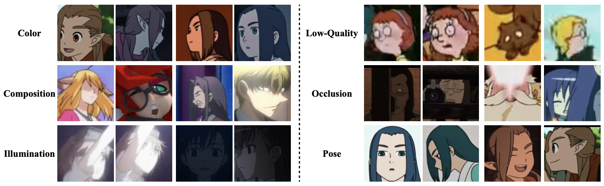

# [A Challenging Benchmark of Anime Style Recognition](https://arxiv.org/abs/2204.14034v1)


This repository provides Large-Scale Anime Style Recognition dataset and baseline approaches of the benchmark.

[**Dataset Download**](#Dataset)  |  [**Citation**](#Citation) 

## Anime Style Recognition (ASR)
Given two images of different anime roles, anime style recognition (ASR) aims to learn abstract painting style to 
determine whether the two images are from the same work, which is an interesting but challenging problem. Unlike 
biometric recognition, such as face recognition, iris recognition, and person re-identification, ASR suffers from a much 
larger semantic gap but receives less attention. In this paper, we propose a challenging ASR benchmark. Firstly, we 
collect a large-scale ASR dataset (LSASRD), which contains 20,937 images of 190 anime works and each work at least has 
ten different roles. In addition to the large-scale, LSASRD contains a list of challenging factors, such as complex 
illuminations, various poses, theatrical colors and exaggerated compositions. Secondly, we design a cross-role protocol 
to evaluate ASR performance, in which query and gallery images must come from different roles to validate an ASR model 
is to learn abstract painting style rather than learn discriminative features of roles. Finally, we apply two powerful 
person re-identification methods, namely, AGW and TransReID, to construct the baseline performance on LSASRD. 
Surprisingly, the recent transformer model (i.e., TransReID) only acquires a 42.24% mAP on LSASRD. Therefore, we believe 
that the ASR task of a huge semantic gap deserves deep and long-term research.



The LSASRD is a challenging dataset established for anime style recognition. The above figure visualizes the statistics of the proposed dataset.

Reference method: [AGW](https://github.com/mangye16/ReID-Surveye) and [TransReID](https://github.com/damo-cv/TransReID)

## Dataset

If you are interested in ASR, you can download a subset of LSASRD here for a glance:

- [BaiduDisk](), [GoogleDrive]().

**If you want the whole dataset, you should follow the steps:**

- Read and Sign the [Database Release Agreement](AGREEMENT.md).
- Submit the document to lei_houtong@stu.hqu.edu.cn or jqzhu@hqu.edu.cn.
- Download dataset from the link received from us by e-mail.

## Acknowledgement

This project was supported by National Training Program on Undergraduate Innovation and Entrepreneurship of China (No. 202110385018).

## Citation

If you use the LSASR dataset or the benchmark for your research, please cite our paper as follows.

```
@InProceedings{Li_2022_CVPR,
    author    = {Li, Haotang and Guo, Shengtao and Lyu, Kailin and Yang, Xiao and Chen, Tianchen and Zhu, Jianqing and Zeng, Huanqiang},
    title     = {A Challenging Benchmark of Anime Style Recognition},
    booktitle = {Proceedings of the IEEE/CVF Conference on Computer Vision and Pattern Recognition (CVPR) Workshops},
    month     = {June},
    year      = {2022},
    pages     = {4721-4730}
}
```